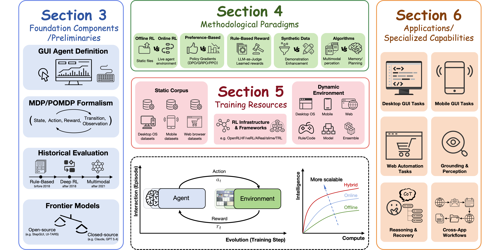
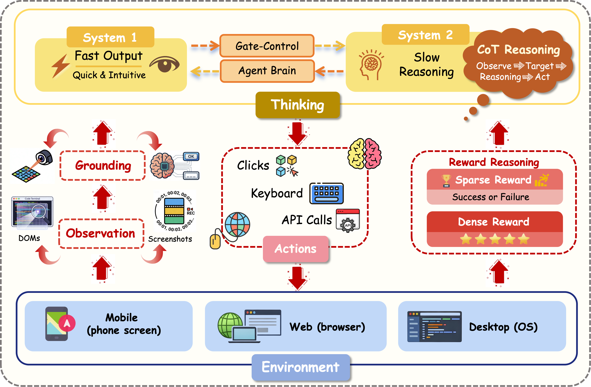
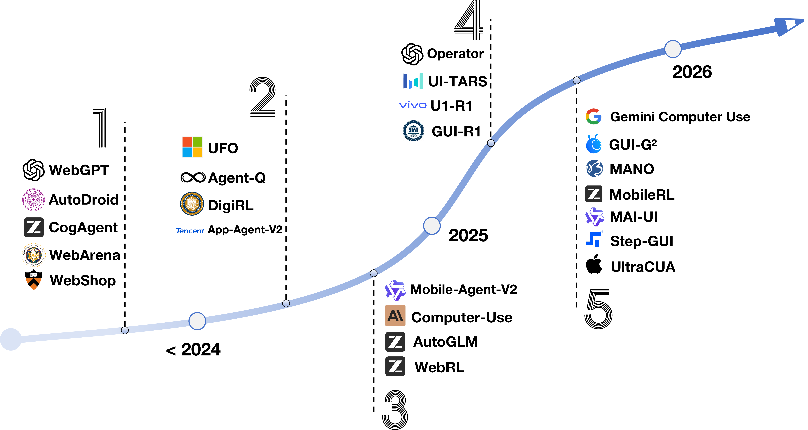
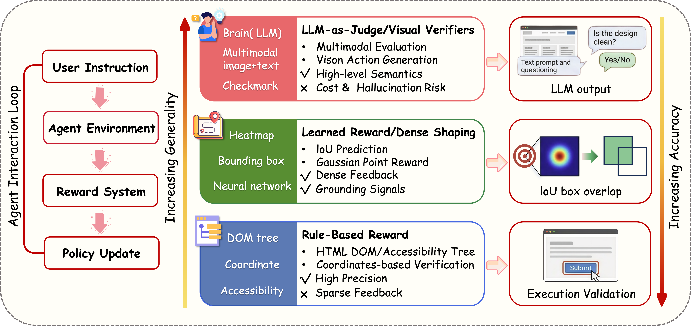
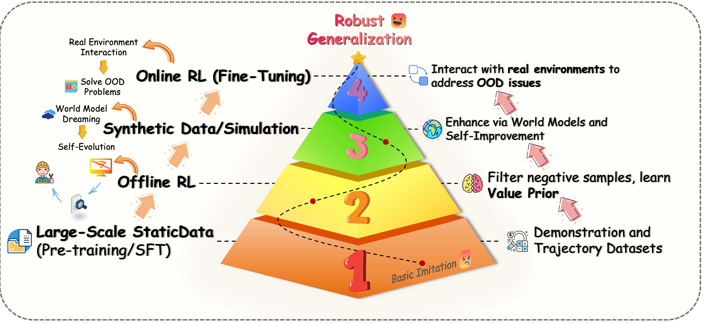
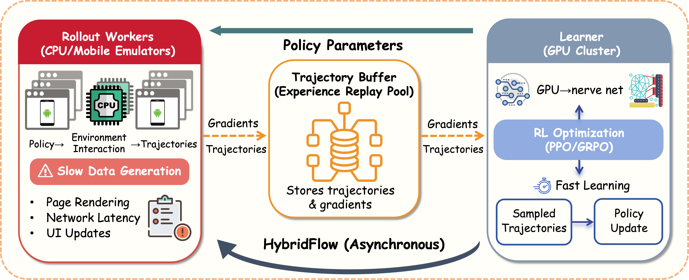

# Awesome Reinforcement Learning for GUI Agents

[](https://awesome.re) [](https://opensource.org/licenses/MIT) [](CONTRIBUTING.md)

This repository provides a comprehensive and curated list of research papers, datasets, and tools focused on **Reinforcement Learning (RL) in GUI Agents**. GUI agents are intelligent systems that perceive graphical interfaces visually and execute tasks through human-like inputs (click, swipe, type).

> 📄 **Based on the survey**: *[GUI Agents with Reinforcement Learning: Toward Digital Inhabitants](https://arxiv.org/abs/2604.27955)*

---

## 📋 Table of Contents
- [🔔 News](#-news)
- [🌟 Introduction](#-introduction)
- [📚 Related Surveys](#-related-surveys)
- [🤝 Contributing](#-contributing)
- [🏗️ RL Methods](#%EF%B8%8F-rl-methods)
  - [Offline Reinforcement Learning](#offline-reinforcement-learning)
  - [Online Reinforcement Learning](#online-reinforcement-learning)
  - [Hybrid Strategies](#hybrid-strategies)
- [🎨 Key Dimensions](#-key-dimensions)
  - [Reward Engineering](#reward-engineering)
  - [Data Efficiency](#data-efficiency)
  - [Technical Innovations](#technical-innovations)
- [📊 Training Resources](#-training-resources)
  - [Datasets](#datasets)
  - [Interactive Environments](#interactive-environments)
  - [RL Infrastructure](#rl-infrastructure)
- [📝 Citation](#-citation)

<p align="center">
  
  <br>
  <em>Overview of the survey structure. We organize our analysis into three main pillars: RL Methods, Key Dimensions, and Training Resources.</em>
</p>

---

## 🔔 News
- **[2026-04-30]** 📄 Our survey *"GUI Agents with Reinforcement Learning: Toward Digital Inhabitants"* is now available on [arXiv](https://arxiv.org/abs/2604.27955)!
- **[2026-04-19]** 🚀 Repository created! Stay tuned for more updates on RL-based GUI Agents.

---

## 🌟 Introduction

Reinforcement Learning for GUI agents addresses the core difficulties of GUI automation: long-horizon credit assignment under sparse rewards, distribution shift across evolving interfaces, and safe exploration. We organize the landscape into three methodological paradigms:

- **Offline RL:** Learning from static datasets without environment interaction.
- **Online RL:** Refinement through continuous trial and error in dynamic environments.
- **Hybrid Strategies:** Bridging pre-training and adaptation via semi-online methods and world models.

<p align="center">
  
  <br>
  <em>Overview of the RL training pipeline for GUI agents. The agent perceives the GUI environment through screenshots, reasons about the task, and executes actions. RL optimizes the policy through reward signals derived from task completion, visual grounding accuracy, and intermediate reasoning quality.</em>
</p>

<p align="center">
  
  <br>
  <em>Timeline of GUI Agent Development from rule-based systems to the multimodal LLM era.</em>
</p>

---


## 📚 Related Surveys

| Paper | Venue / Year |
| --- | --- |
| [Gui agents: A survey](https://arxiv.org/abs/2412.13501) | Findings of ACL 2025 |
| [Gui agents with foundation models: A comprehensive survey](https://arxiv.org/abs/2411.04890) | arXiv 2024 |
| [Large language model-brained gui agents: A survey](https://arxiv.org/abs/2411.18279) | arXiv 2024 |
| [Llm-powered gui agents in phone automation: Surveying progress and prospects](https://arxiv.org/abs/2504.19838) | arXiv 2025 |
| [A survey on (m) llm-based gui agents](https://arxiv.org/abs/2504.13865) | arXiv 2025 |
| [A Comprehensive Survey of Agents for Computer Use: Foundations, Challenges, and Future Directions](https://arxiv.org/abs/2501.16150) | arXiv 2025 |
| [A survey of webagents: Towards next-generation ai agents for web automation with large foundation models](https://arxiv.org/abs/2503.23350) | KDD |
| [Api agents vs. gui agents: Divergence and convergence](https://arxiv.org/abs/2503.11069) | arXiv 2025 |
| [Survey on large language model-enhanced reinforcement learning: Concept, taxonomy, and methods](https://arxiv.org/abs/2404.00282) | TNNLS |
| [Reinforcement learning enhanced llms: A survey](https://arxiv.org/abs/2412.10400) | arXiv 2024 |
| [The landscape of agentic reinforcement learning for llms: A survey](https://arxiv.org/abs/2509.02547) | arXiv 2025 |
| [A survey of reinforcement learning for large reasoning models](https://arxiv.org/abs/2509.08827) | arXiv 2025 |
| [Llm-based multi-agent reinforcement learning: Current and future directions](https://arxiv.org/abs/2405.11106) | arXiv 2024 |
| [Os agents: A survey on mllm-based agents for computer, phone and browser use](https://arxiv.org/abs/2508.04482) | ACL |
| [From system 1 to system 2: A survey of reasoning large language models](https://arxiv.org/abs/2502.17419) | arXiv 2025 |
| [Lifelong learning of large language model based agents: A roadmap](https://arxiv.org/abs/2501.07278) | TPAMI |

---

## 🤝 Contributing
Contributions are welcome! Please see [CONTRIBUTING.md](CONTRIBUTING.md) for guidelines.

---

## 🏗️ RL Methods

<p align="center">
  
  <br>
  <em>Overview of the RL training pipeline for GUI agents. The agent perceives the GUI environment through screenshots, reasons about the task, and executes actions. RL optimizes the policy through reward signals derived from task completion, visual grounding accuracy, and intermediate reasoning quality.</em>
</p>

### Frontier Models

| Paper | Venue / Year |
| --- | --- |
| [Agent S: an Open Agentic Framework That Uses Computers Like a Human](https://arxiv.org/abs/2410.08164) | arXiv 2024 |
| [Agent S2: a Compositional Generalist-specialist Framework for Computer Use Agents](https://arxiv.org/abs/2504.00906) | arXiv 2025 |
| [Constitutional Ai: Harmlessness from Ai Feedback](https://arxiv.org/abs/2212.08073) | arXiv 2022 |
| [Digirl: Training In-the-wild Device-control Agents with Autonomous Reinforcement Learning](https://arxiv.org/abs/2406.11896) | NeurIPS 2024 |
| [Qwen3-vl Technical Report](https://arxiv.org/abs/2511.21631) | 2025 |
| [Gui-eyes: Tool-augmented Perception for Visual Grounding in Gui Agents](https://arxiv.org/abs/2601.09770) | arXiv 2026 |
| [Mano Technical Report](https://arxiv.org/abs/2509.17336) | arXiv 2025 |
| [Gui Exploration Lab: Enhancing Screen Navigation in Agents Via Multi-turn Reinforcement Learning](https://arxiv.org/abs/2512.02423) | 2025 |
| [Navigating the Digital World as Humans Do: Universal Visual Grounding for Gui Agents](https://arxiv.org/abs/2410.05243) | arXiv 2024 |
| [Seed1. 5-vl Technical Report](https://arxiv.org/abs/2505.07062) | arXiv 2025 |
| [Cogagent: a Visual Language Model for Gui Agents](https://arxiv.org/abs/2312.08914) | CVPR 2024 |
| [Clickagent: Enhancing Ui Location Capabilities of Autonomous Agents](https://arxiv.org/abs/2410.11872) | SIGDIAL 2025 |
| [Spiritsight Agent: Advanced Gui Agent with One Look](https://arxiv.org/abs/2503.03196) | CVPR 2025 |
| [Efficient Multi-turn Rl for Gui Agents Via Decoupled Training and Adaptive Data Curation](https://arxiv.org/abs/2509.23866) | arXiv 2025 |
| [Showui: One Vision-language-action Model for Gui Visual Agent](https://arxiv.org/abs/2411.17465) | CVPR 2025 |
| [Infigui-g1: Advancing Gui Grounding with Adaptive Exploration Policy Optimization](https://arxiv.org/abs/2508.05731) | AAAI 2026 |
| [Infiguiagent: a Multimodal Generalist Gui Agent with Native Reasoning and Reflection](https://arxiv.org/abs/2501.04575) | arXiv 2025 |
| [Ui-s1: Advancing Gui Automation Via Semi-online Reinforcement Learning](https://arxiv.org/abs/2509.11543) | arXiv 2025 |
| [Ui-r1: Enhancing Efficient Action Prediction of Gui Agents by Reinforcement Learning](https://arxiv.org/abs/2503.21620) | arXiv 2025 |
| [Gui-r1: a Generalist R1-style Vision-language Action Model for Gui Agents](https://arxiv.org/abs/2504.10458) | arXiv 2025 |
| [Visual Test-time Scaling for Gui Agent Grounding](https://arxiv.org/abs/2505.00684) | ICCV 2025 |
| [Computer-using Agent](https://openai.com/index/computer-using-agent/) | 2025 |
| [Ui-tars: Pioneering Automated Gui Interaction with Native Agents](https://arxiv.org/abs/2501.12326) | arXiv 2025 |
| [Falcon-ui: Understanding Gui Before Following User Instructions](https://arxiv.org/abs/2412.09362) | arXiv 2024 |
| [Coact-1: Computer-using Agents with Coding as Actions](https://arxiv.org/abs/2508.03923) | arXiv 2025 |
| [Gui-g$^2](https://arxiv.org/abs/2507.15846) | 2025 |
| [Magicgui: a Foundational Mobile Gui Agent with Scalable Data Pipeline and Reinforcement Fine-tuning](https://arxiv.org/abs/2508.03700) | arXiv 2025 |
| [Kimi-vl Technical Report](https://arxiv.org/abs/2504.07491) | arXiv 2025 |
| [Internvl3. 5: Advancing Open-source Multimodal Models in Versatility, Reasoning, and Efficiency](https://arxiv.org/abs/2508.18265) | arXiv 2025 |
| [Opencua: Open Foundations for Computer-use Agents](https://arxiv.org/abs/2508.09123) | arXiv 2025 |
| [Ponder \& Press: Advancing Visual Gui Agent Towards General Computer Control](https://arxiv.org/abs/2412.01268) | Findings of ACL 2025 |
| [Ui-tars-2 Technical Report: Advancing Gui Agent with Multi-turn Reinforcement Learning](https://arxiv.org/abs/2509.02544) | arXiv 2025 |
| [Os-copilot: Towards Generalist Computer Agents with Self-improvement](https://arxiv.org/abs/2402.07456) | arXiv 2024 |
| [Backtrackagent: Enhancing Gui Agent with Error Detection and Backtracking Mechanism](https://arxiv.org/abs/2505.20660) | arXiv 2025 |
| [Vsc-rl: Advancing Autonomous Vision-language Agents with Variational Subgoal-conditioned Reinforcement Learning](https://arxiv.org/abs/2502.07949) | arXiv 2025 |
| [Aguvis: Unified Pure Vision Agents for Autonomous Gui Interaction](https://arxiv.org/abs/2412.04454) | arXiv 2024 |
| [Step-gui Technical Report](https://arxiv.org/abs/2512.15431) | arXiv 2025 |
| [Aria-ui: Visual Grounding for Gui Instructions](https://arxiv.org/abs/2412.16256) | Findings of ACL 2025 |
| [Gta1: Gui Test-time Scaling Agent](https://arxiv.org/abs/2507.05791) | arXiv 2025 |
| [Mobile-agent-v3: Fundamental Agents for Gui Automation](https://arxiv.org/abs/2508.15144) | arXiv 2025 |
| [Se-gui: Enhancing Visual Grounding for Gui Agents Via Self-evolutionary Reinforcement Learning](https://arxiv.org/abs/2505.12370) | N/A |
| [Uitron: Foundational Gui Agent with Advanced Perception and Planning](https://arxiv.org/abs/2508.21767) | arXiv 2025 |
| [Agentcpm-gui: Building Mobile-use Agents with Reinforcement Fine-tuning](https://arxiv.org/abs/2506.01391) | EMNLP 2025 |
| [Phi-ground Tech Report: Advancing Perception in Gui Grounding](https://arxiv.org/abs/2507.23779) | arXiv 2025 |
| [Ufo2: the Desktop Agentos](https://arxiv.org/abs/2504.14603) | arXiv 2025 |
| [Omegause: Building a General-purpose Gui Agent for Autonomous Task Execution](https://arxiv.org/abs/2601.20380) | arXiv 2026 |
| [Mai-ui Technical Report: Real-world Centric Foundation Gui Agents](https://arxiv.org/abs/2512.22047) | arXiv 2025 |
| [Introducing computer use, a new Claude 3.5 Sonnet, and Claude 3.5 Haiku](https://www.anthropic.com/news/3-5-models-and-computer-use) | N/A |
| [Introducing the Gemini 2.5 Computer Use model](https://developers.googleblog.com/en/gemini-25-computer-use-model/) | N/A |
| [Computer-Using Agent](https://openai.com/index/computer-using-agent/) | N/A |
| [Os-atlas: A foundation action model for generalist gui agents](https://arxiv.org/abs/2410.23218) | ICLR |
| [Agent q: Advanced reasoning and learning for autonomous ai agents](https://arxiv.org/abs/2408.07199) | arXiv 2024 |


### Reinforcement Learning Paradigms

#### Offline RFT Methods

| Paper | Venue / Year |
| --- | --- |
| [Direct Preference Optimization: Your Language Model Is Secretly a Reward Model](https://arxiv.org/abs/2305.18290) | NeurIPS 2023 |
| [Deepseekmath: Pushing the Limits of Mathematical Reasoning in Open Language Models](https://arxiv.org/abs/2402.03300) | arXiv 2024 |
| [Conservative q-learning for offline reinforcement learning](https://arxiv.org/abs/2006.04779) | NeurIPS |
| [Offline reinforcement learning with implicit q-learning](https://arxiv.org/abs/2110.06169) | ICLR |
| [Decision transformer: Reinforcement learning via sequence modeling](https://arxiv.org/abs/2106.01345) | NeurIPS |
| [Behavioral cloning from observation](https://arxiv.org/abs/1805.01954) | IJCAI |
| [Implicit behavioral cloning](https://arxiv.org/abs/2109.00137) | Conference on robot learning |
| [Advantage-weighted regression: Simple and scalable off-policy reinforcement learning](https://arxiv.org/abs/1910.00177) | arXiv 2019 |


#### Representative Methods

| Paper | Venue / Year |
| --- | --- |
| [Digirl: Training In-the-wild Device-control Agents with Autonomous Reinforcement Learning](https://arxiv.org/abs/2406.11896) | NeurIPS 2024 |
| [Dynaweb: Model-based Reinforcement Learning of Web Agents](https://arxiv.org/abs/2601.22149) | arXiv 2026 |
| [Ui-agile: Advancing Gui Agents with Effective Reinforcement Learning and Precise Inference-time Grounding](https://arxiv.org/abs/2507.22025) | arXiv 2025 |
| [Ui-s1: Advancing Gui Automation Via Semi-online Reinforcement Learning](https://arxiv.org/abs/2509.11543) | arXiv 2025 |
| [Hiper: Hierarchical Reinforcement Learning with Explicit Credit Assignment for Large Language Model Agents](https://arxiv.org/abs/2602.16165) | arXiv 2026 |
| [Probabilistic Subgoal Representations for Hierarchical Reinforcement Learning](https://arxiv.org/abs/2406.16707) | arXiv 2024 |
| [Hi-agent: Hierarchical Vision-language Agents for Mobile Device Control](https://arxiv.org/abs/2510.14388) | arXiv 2025 |
| [Ultracua: a Foundation Model for Computer Use Agents with Hybrid Action](https://arxiv.org/abs/2510.17790) | arXiv 2025 |
| [ARPO: End-to-End Policy Optimization for GUI Agents with Experience Replay](https://arxiv.org/abs/2505.16282) | arXiv 2025 |
| [Mobilerl: Online agentic reinforcement learning for mobile gui agents](https://arxiv.org/abs/2509.18119) | arXiv 2025 |
| [Digi-q: Learning q-value functions for training device-control agents](https://arxiv.org/abs/2502.15760) | arXiv 2025 |


#### Emerging Directions

| Paper | Venue / Year |
| --- | --- |
| [Group-in-group Policy Optimization for Llm Agent Training](https://arxiv.org/abs/2505.10978) | arXiv 2025 |
| [Enhancing Cooperative Multi-agent Reinforcement Learning with State Modelling and Adversarial Exploration](https://arxiv.org/abs/2505.05262) | arXiv 2025 |
| [Wcsac: Worst-case Soft Actor Critic for Safety-constrained Reinforcement Learning](https://ojs.aaai.org/index.php/AAAI/article/view/17272) | AAAI 2021 |
| [Constrained Reinforcement Learning with Smoothed Log Barrier Function](https://arxiv.org/abs/2403.14508) | arXiv 2024 |
| [CGL: Advancing Continual GUI Learning via Reinforcement Fine-Tuning](https://arxiv.org/abs/2603.02951) | arXiv 2026 |
| [Continual GUI Agents](https://arxiv.org/abs/2601.20732) | arXiv 2026 |
| [Autonomous Continual Learning of Computer-Use Agents for Environment Adaptation](https://arxiv.org/abs/2602.10356) | arXiv 2026 |
| [Online continual learning for interactive instruction following agents](https://arxiv.org/abs/2403.07548) | arXiv 2024 |


#### Algorithmic Advances: Exploration and Multi-Turn Optimization

| Paper | Venue / Year |
| --- | --- |
| [Agentic Entropy-balanced Policy Optimization](https://arxiv.org/abs/2510.14545) | arXiv 2025 |
| [Nested Browser-use Learning for Agentic Information Seeking](https://arxiv.org/abs/2512.23647) | arXiv 2025 |
| [Infigui-g1: Advancing Gui Grounding with Adaptive Exploration Policy Optimization](https://arxiv.org/abs/2508.05731) | AAAI 2026 |
| [Webrl: Training Llm Web Agents Via Self-evolving Online Curriculum Reinforcement Learning](https://arxiv.org/abs/2411.02337) | ICLR 2024 |
| [Gui-g$^2](https://arxiv.org/abs/2507.15846) | 2025 |


## 🎨 Key Dimensions

### Reward Engineering
The process of defining objective feedback signals for GUI tasks.

<p align="center">
  
  <br>
  <em>The Reward Engineering Pyramid balances accuracy and generality for GUI Agents: rule-based rewards offer precision, while learned rewards and LLM-as-judge enable semantic depth.</em>
</p>


#### Reward Engineering

| Paper | Venue / Year |
| --- | --- |
| [Gui Agents: a Survey](https://arxiv.org/abs/2412.13501) | Findings of ACL 2025 |
| [Rlthf: Targeted human feedback for llm alignment](https://arxiv.org/abs/2502.13417) | arXiv 2025 |
| [Rlaif vs. rlhf: Scaling reinforcement learning from human feedback with ai feedback](https://arxiv.org/abs/2309.00267) | NeurIPS |
| [Curriculum-rlaif: Curriculum alignment with reinforcement learning from ai feedback](https://arxiv.org/abs/2505.20075) | arXiv 2025 |
| [Agentprm: Process reward models for llm agents via step-wise promise and progress](https://arxiv.org/abs/2511.08325) | arXiv 2025 |
| [Process reinforcement through implicit rewards](https://arxiv.org/abs/2502.01456) | arXiv 2025 |
| [Ovm, outcome-supervised value models for planning in mathematical reasoning](https://arxiv.org/abs/2311.09724) | Findings of ACL 2024 |


#### Rule-Based Rewards

| Paper | Venue / Year |
| --- | --- |
| [Mind2web: Towards a Generalist Agent for the Web](https://arxiv.org/abs/2306.06070) | NeurIPS 2023 |
| [Infigui-g1: Advancing Gui Grounding with Adaptive Exploration Policy Optimization](https://arxiv.org/abs/2508.05731) | AAAI 2026 |
| [Ui-r1: Enhancing Efficient Action Prediction of Gui Agents by Reinforcement Learning](https://arxiv.org/abs/2503.21620) | arXiv 2025 |
| [Gui-g$^2](https://arxiv.org/abs/2507.15846) | 2025 |
| [Lpo: Towards Accurate Gui Agent Interaction Via Location Preference Optimization](https://arxiv.org/abs/2506.09373) | arXiv 2025 |
| [Btl-ui: Blink-think-link Reasoning Model for Gui Agent](https://arxiv.org/abs/2509.15566) | arXiv 2025 |


#### LLM-as-Judge Rewards

| Paper | Venue / Year |
| --- | --- |
| [Smartsnap: Proactive Evidence Seeking for Self-verifying Agents](https://arxiv.org/abs/2512.22322) | arXiv 2025 |
| [Prore: a Proactive Reward System for Gui Agents Via Reasoner--actor Collaboration](https://arxiv.org/abs/2509.21823) | arXiv 2025 |
| [Webrl: Training Llm Web Agents Via Self-evolving Online Curriculum Reinforcement Learning](https://arxiv.org/abs/2411.02337) | ICLR 2024 |
| [Zerogui: Automating Online Gui Learning at Zero Human Cost](https://arxiv.org/abs/2505.23762) | arXiv 2025 |


#### Learned Rewards

| Paper | Venue / Year |
| --- | --- |
| [Infigui-g1: Advancing Gui Grounding with Adaptive Exploration Policy Optimization](https://arxiv.org/abs/2508.05731) | AAAI 2026 |
| [Gui-g$^2](https://arxiv.org/abs/2507.15846) | 2025 |


### Data Efficiency

#### Synthetic Data via World Models

| Paper | Venue / Year |
| --- | --- |
| [Scaling Agent Learning Via Experience Synthesis](https://arxiv.org/abs/2511.03773) | arXiv 2025 |
| [Simura: a World-model-driven Simulative Reasoning Architecture for General Goal-oriented Agents](https://arxiv.org/abs/2507.23773) | arXiv 2025 |
| [Websynthesis: World-model-guided Mcts for Efficient Webui-trajectory Synthesis](https://arxiv.org/abs/2507.04370) | arXiv 2025 |
| [Llms as Scalable, General-purpose Simulators for Evolving Digital Agent Training](https://arxiv.org/abs/2510.14969) | arXiv 2025 |
| [Webworld: a Large-scale World Model for Web Agent Training](https://arxiv.org/abs/2602.14721) | arXiv 2026 |
| [Code2world: a Gui World Model Via Renderable Code Generation](https://arxiv.org/abs/2602.09856) | arXiv 2026 |
| [Is your llm secretly a world model of the internet? model-based planning for web agents](https://arxiv.org/abs/2411.06559) | arXiv 2024 |


#### Enhancement of Human Demonstrations

| Paper | Venue / Year |
| --- | --- |
| [Gui-rewalk: Massive Data Generation for Gui Agent Via Stochastic Exploration and Intent-aware Reasoning](https://arxiv.org/abs/2509.15738) | arXiv 2025 |
| [Watch and Learn? Using Edpuzzle to Enhance the Use of Online Videos](https://journals.sagepub.com/doi/10.1177/2379298119833860) | Management Teaching Review 2019 |
| [Watch and Learn: Learning to Use Computers from Online Videos](https://arxiv.org/abs/2510.04673) | arXiv 2025 |
| [Os-genesis: Automating Gui Agent Trajectory Construction Via Reverse Task Synthesis](https://arxiv.org/abs/2412.19723) | ACL 2025 |
| [Agenttrek: Agent Trajectory Synthesis Via Guiding Replay with Web Tutorials](https://arxiv.org/abs/2412.09605) | arXiv 2024 |
| [Prune4web: Dom Tree Pruning Programming for Web Agent](https://arxiv.org/abs/2511.21398) | arXiv 2025 |


#### Iterative Self-Improvement

| Paper | Venue / Year |
| --- | --- |
| [Gui-r1: a Generalist R1-style Vision-language Action Model for Gui Agents](https://arxiv.org/abs/2504.10458) | arXiv 2025 |
| [Co-epg: a Framework for Co-evolution of Planning and Grounding in Autonomous Gui Agents](https://arxiv.org/abs/2511.10705) | arXiv 2025 |


### Technical Innovations

#### Multimodal Perception: Active and Adaptive Visual Grounding

| Paper | Venue / Year |
| --- | --- |
| [Gui-eyes: Tool-augmented Perception for Visual Grounding in Gui Agents](https://arxiv.org/abs/2601.09770) | arXiv 2026 |
| [GroundCUA: Grounding Computer Use Agents on Human Demonstrations](https://arxiv.org/abs/2511.07332) | ICLR 2026 |
| [Infigui-g1: Advancing Gui Grounding with Adaptive Exploration Policy Optimization](https://arxiv.org/abs/2508.05731) | AAAI 2026 |
| [Gui-g$^2](https://arxiv.org/abs/2507.15846) | 2025 |
| [Gui-actor: Coordinate-free Visual Grounding for Gui Agents](https://arxiv.org/abs/2506.03143) | arXiv 2025 |
| [Gui-aima: Aligning Intrinsic Multimodal Attention with a Context Anchor for Gui Grounding](https://arxiv.org/abs/2511.00810) | arXiv 2025 |
| [Seeclick: Harnessing gui grounding for advanced visual gui agents](https://arxiv.org/abs/2401.10935) | ACL |
| [Mapping natural language commands to web elements](https://arxiv.org/abs/1808.09132) | EMNLP 2018 |
| [Understanding html with large language models](https://arxiv.org/abs/2210.03945) | Findings of EMNLP 2023 |
| [Attacking vision-language computer agents via pop-ups](https://arxiv.org/abs/2411.02391) | ACL |


#### Memory and Planning: Sustaining Context over Long Horizons

| Paper | Venue / Year |
| --- | --- |
| [Mga: Memory-driven Gui Agent for Observation-centric Interaction](https://arxiv.org/abs/2510.24168) | arXiv 2025 |
| [Memr $\^](https://arxiv.org/abs/2512.20237) | 2025 |
| [Plan-and-act: Improving Planning of Agents for Long-horizon Tasks](https://arxiv.org/abs/2503.09572) | arXiv 2025 |
| [Magnet: Towards Adaptive Gui Agents with Memory-driven Knowledge Evolution](https://arxiv.org/abs/2601.19199) | arXiv 2026 |
| [Agentprog: Empowering Long-horizon Gui Agents with Program-guided Context Management](https://arxiv.org/abs/2512.10371) | arXiv 2025 |
| [History-aware Reasoning for Gui Agents](https://arxiv.org/abs/2511.09127) | arXiv 2025 |
| [Webagent-r1: Training Web Agents Via End-to-end Multi-turn Reinforcement Learning](https://arxiv.org/abs/2505.16421) | EMNLP 2025 |
| [Auto-scaling Continuous Memory for Gui Agent](https://arxiv.org/abs/2510.09038) | arXiv 2025 |
| [Memsearcher: Training Llms to Reason, Search and Manage Memory Via End-to-end Reinforcement Learning](https://arxiv.org/abs/2511.02805) | arXiv 2025 |
| [MemR $\^{} 3$: Memory Retrieval via Reflective Reasoning for LLM Agents](https://arxiv.org/abs/2512.20237) | arXiv 2025 |


## 📊 Training Resources

### Datasets

<p align="center">
  
  <br>
  <em>This pyramid depicts a four-stage data-training pipeline for agent capability, progressing from static data imitation to offline RL, synthetic simulation, and online RL.</em>
</p>


#### Demonstration and Trajectory Datasets

| Paper | Venue / Year |
| --- | --- |
| [Mind2web: Towards a Generalist Agent for the Web](https://arxiv.org/abs/2306.06070) | NeurIPS 2023 |
| [Omniact: a Dataset and Benchmark for Enabling Multimodal Generalist Autonomous Agents for Desktop and Web](https://arxiv.org/abs/2402.17553) | ECCV 2024 |
| [On the Effects of Data Scale on Ui Control Agents](https://arxiv.org/abs/2406.03679) | NeurIPS 2024 |
| [Androidinthewild: a Large-scale Dataset for Android Device Control](https://arxiv.org/abs/2307.10088) | NeurIPS 2023 |
| [Guiodyssey: A comprehensive dataset for cross-app gui navigation on mobile devices](https://arxiv.org/abs/2406.08451) | ICCV |
| [Learnact: Few-shot mobile gui agent with a unified demonstration benchmark](https://arxiv.org/abs/2504.13805) | arXiv 2025 |


#### Perception and Grounding Datasets

| Paper | Venue / Year |
| --- | --- |
| [Unveiling the Tricks: Automated Detection of Dark Patterns in Mobile Applications](https://arxiv.org/abs/2308.05898) | UIST 2023 |
| [Rico: a Mobile App Dataset for Building Data-driven Design Applications](https://interactionmining.org/rico) | UIST 2017 |
| [Widget Captioning: Generating Natural Language Description for Mobile User Interface Elements](https://arxiv.org/abs/2010.04295) | EMNLP 2020 |
| [Ferret-ui 2: Mastering Universal User Interface Understanding Across Platforms](https://arxiv.org/abs/2410.18967) | ICLR 2024 |
| [Screenspot-pro: Gui Grounding for Professional High-resolution Computer Use](https://arxiv.org/abs/2504.07981) | ACM MM 2025 |
| [GroundCUA: Grounding Computer Use Agents on Human Demonstrations](https://arxiv.org/abs/2511.07332) | ICLR 2026 |
| [Screen2words: Automatic Mobile Ui Summarization with Multimodal Learning](https://arxiv.org/abs/2108.03353) | UIST 2021 |
| [Ferret-ui: Grounded Mobile Ui Understanding with Multimodal Llms](https://arxiv.org/abs/2404.05719) | ECCV 2024 |


#### Synthetic and RL-Generated Corpora

| Paper | Venue / Year |
| --- | --- |
| [Agent-x: Evaluating Deep Multimodal Reasoning in Vision-centric Agentic Tasks](https://arxiv.org/abs/2505.24876) | arXiv 2025 |
| [Gui-bee: Align Gui Action Grounding to Novel Environments Via Autonomous Exploration](https://arxiv.org/abs/2501.13896) | arXiv 2025 |
| [End-to-end Navigation with Vision Language Models: Transforming Spatial Reasoning Into Question-answering](https://arxiv.org/abs/2411.05755) | arXiv 2024 |
| [Visualwebarena: Evaluating Multimodal Agents on Realistic Visual Web Tasks](https://arxiv.org/abs/2401.13649) | ACL 2024 |
| [Explorer: Scaling Exploration-driven Web Trajectory Synthesis for Multimodal Web Agents](https://arxiv.org/abs/2502.11357) | Findings of ACL 2025 |
| [Webcanvas: Benchmarking Web Agents in Online Environments](https://arxiv.org/abs/2406.12373) | arXiv 2024 |
| [Ui-tars: Pioneering Automated Gui Interaction with Native Agents](https://arxiv.org/abs/2501.12326) | arXiv 2025 |
| [Scaling Synthetic Task Generation for Agents Via Exploration](https://arxiv.org/abs/2509.25047) | arXiv 2025 |
| [Androidworld: a Dynamic Benchmarking Environment for Autonomous Agents](https://arxiv.org/abs/2405.14573) | ICLR 2024 |
| [Bearcubs: a Benchmark for Computer-using Web Agents](https://arxiv.org/abs/2503.07919) | arXiv 2025 |
| [Beyond Browsing: Api-based Web Agents](https://arxiv.org/abs/2410.16464) | Findings of ACL 2025 |
| [Webwalker: Benchmarking Llms in Web Traversal](https://arxiv.org/abs/2501.07572) | ACL 2025 |
| [Osworld: Benchmarking Multimodal Agents for Open-ended Tasks in Real Computer Environments](https://arxiv.org/abs/2404.07972) | NeurIPS 2024 |
| [Theagentcompany: Benchmarking Llm Agents on Consequential Real World Tasks](https://arxiv.org/abs/2412.14161) | arXiv 2024 |
| [Appagent: Multimodal Agents as Smartphone Users](https://arxiv.org/abs/2312.13771) | CHI 2025 |
| [Webarena: a Realistic Web Environment for Building Autonomous Agents](https://arxiv.org/abs/2307.13854) | ICLR 2023 |


### Interactive Environments

#### Web and Browser Environments

| Paper | Venue / Year |
| --- | --- |
| [The Browsergym Ecosystem for Web Agent Research](https://arxiv.org/abs/2412.05467) | arXiv 2024 |
| [Mind2web: Towards a Generalist Agent for the Web](https://arxiv.org/abs/2306.06070) | NeurIPS 2023 |
| [A Data-driven Approach for Learning to Control Computers](https://arxiv.org/abs/2202.08137) | arXiv 2022 |
| [Visualwebarena: Evaluating Multimodal Agents on Realistic Visual Web Tasks](https://arxiv.org/abs/2401.13649) | ACL 2024 |
| [Reinforcement Learning on Web Interfaces Using Workflow-guided Exploration](https://arxiv.org/abs/1802.08802) | ICLR 2018 |
| [Webchorearena: Evaluating Web Browsing Agents on Realistic Tedious Web Tasks](https://arxiv.org/abs/2506.01952) | arXiv 2025 |
| [Webshop: Towards Scalable Real-world Web Interaction with Grounded Language Agents](https://arxiv.org/abs/2207.01206) | NeurIPS 2022 |
| [Webarena: a Realistic Web Environment for Building Autonomous Agents](https://arxiv.org/abs/2307.13854) | ICLR 2023 |
| [Webgpt: Browser-assisted question-answering with human feedback](https://arxiv.org/abs/2112.09332) | arXiv 2021 |
| [Webvoyager: Building an end-to-end web agent with large multimodal models](https://arxiv.org/abs/2401.13919) | ACL |
| [World of bits: An open-domain platform for web-based agents](https://proceedings.mlr.press/v70/shi17a.html) | ICML |
| [ClawBench: Can AI Agents Complete Everyday Online Tasks?](https://arxiv.org/abs/2604.08523) | arXiv 2026 |


#### Desktop and OS Environments

| Paper | Venue / Year |
| --- | --- |
| [Computerrl: Scaling End-to-end Online Reinforcement Learning for Computer Use Agents](https://arxiv.org/abs/2508.14040) | arXiv 2025 |
| [Screenagent: a Vision Language Model-driven Computer Control Agent](https://arxiv.org/abs/2402.07945) | IJCAI 2024 |
| [Osworld: Benchmarking Multimodal Agents for Open-ended Tasks in Real Computer Environments](https://arxiv.org/abs/2404.07972) | NeurIPS 2024 |
| [Windows agent arena: Evaluating multi-modal os agents at scale](https://arxiv.org/abs/2409.08264) | arXiv 2024 |
| [Ui-vision: A desktop-centric gui benchmark for visual perception and interaction](https://arxiv.org/abs/2503.15661) | arXiv 2025 |


#### Mobile Environments

| Paper | Venue / Year |
| --- | --- |
| [Androidworld: a Dynamic Benchmarking Environment for Autonomous Agents](https://arxiv.org/abs/2405.14573) | ICLR 2024 |
| [Mobilegui-rl: Advancing Mobile Gui Agent Through Reinforcement Learning in Online Environment](https://arxiv.org/abs/2507.05720) | arXiv 2025 |
| [Androidenv: a Reinforcement Learning Platform for Android](https://arxiv.org/abs/2105.13231) | arXiv 2021 |
| [Uisim: an Interactive Image-based Ui Simulator for Dynamic Mobile Environments](https://arxiv.org/abs/2509.21733) | arXiv 2025 |
| [Benchmarking Mobile Device Control Agents across Diverse Configurations](https://arxiv.org/abs/2404.16660) | CoLLAs 2025 |
| [MobileSafetyBench: Evaluating Safety of Autonomous Agents in Mobile Device Control](https://arxiv.org/abs/2410.17520) | arXiv 2024 |
| [Mobile-env: a Universal Platform for Training and Evaluation of Mobile Interaction](https://arxiv.org/abs/2305.08144) | CoRR 2023 |
| [Mai-ui Technical Report: Real-world Centric Foundation Gui Agents](https://arxiv.org/abs/2512.22047) | arXiv 2025 |


#### Cross-Platform Trends and Synthesis

| Paper | Venue / Year |
| --- | --- |
| [Osworld-mcp: Benchmarking Mcp Tool Invocation in Computer-use Agents](https://arxiv.org/abs/2510.24563) | arXiv 2025 |
| [Mcpworld: a Unified Benchmarking Testbed for Api, Gui, and Hybrid Computer Use Agents](https://arxiv.org/abs/2506.07672) | arXiv 2025 |
| [Os-harm: A benchmark for measuring safety of computer use agents](https://arxiv.org/abs/2506.14866) | arXiv 2025 |


### RL Infrastructure

<p align="center">
  
  <br>
  <em>An asynchronous distributed architecture for GUI RL agent training, decoupling slow environment interaction from fast GPU learning.</em>
</p>


#### VLM-RL Algorithm Libraries and Framework Evolution

| Paper | Venue / Year |
| --- | --- |
| [Openrlhf: an Easy-to-use, Scalable and High-performance Rlhf Framework](https://arxiv.org/abs/2405.11143) | EMNLP 2024 |
| [Efficient Memory Management for Large Language Model Serving with Pagedattention](https://arxiv.org/abs/2309.06180) | SOSP 2023 |
| [Real: Efficient Rlhf Training of Large Language Models with Parameter Reallocation](https://arxiv.org/abs/2406.14088) | MLSys 2025 |
| [Hybridflow: a Flexible and Efficient Rlhf Framework](https://arxiv.org/abs/2409.19256) | EuroSys 2025 |
| [Megatron-lm: Training Multi-billion Parameter Language Models Using Model Parallelism](https://arxiv.org/abs/1909.08053) | arXiv 2019 |
| [Rewarddance: Reward Scaling in Visual Generation](https://arxiv.org/abs/2509.08826) | arXiv 2025 |
| [Pytorch Fsdp: Experiences on Scaling Fully Sharded Data Parallel](https://arxiv.org/abs/2304.11277) | VLDB 2023 |


#### Distributed Rollout and Training Architectures

| Paper | Venue / Year |
| --- | --- |
| [Areal: a Large-scale Asynchronous Reinforcement Learning System for Language Reasoning](https://arxiv.org/abs/2505.24298) | arXiv 2025 |
| [Distrl: an Asynchronous Distributed Reinforcement Learning Framework for On-device Control Agents](https://arxiv.org/abs/2410.14803) | arXiv 2024 |
| [Agent. Xpu: Efficient Scheduling of Agentic Llm Workloads on Heterogeneous Soc](https://arxiv.org/abs/2506.24045) | arXiv 2025 |
| [Hethub: a Distributed Training System with Heterogeneous Cluster for Large-scale Models](https://arxiv.org/abs/2405.16256) | arXiv 2024 |


#### Reward Engineering and Verification Systems

| Paper | Venue / Year |
| --- | --- |
| [Agentic Reward Modeling: Verifying Gui Agent Via Online Proactive Interaction](https://arxiv.org/abs/2602.00575) | arXiv 2026 |
| [Mano Technical Report](https://arxiv.org/abs/2509.17336) | arXiv 2025 |
| [Infigui-g1: Advancing Gui Grounding with Adaptive Exploration Policy Optimization](https://arxiv.org/abs/2508.05731) | AAAI 2026 |
| [Progrm: Build Better Gui Agents with Progress Rewards](https://arxiv.org/abs/2505.18121) | arXiv 2025 |


#### Memory Management and Long-Horizon Reasoning

| Paper | Venue / Year |
| --- | --- |
| [Mga: Memory-driven Gui Agent for Observation-centric Interaction](https://arxiv.org/abs/2510.24168) | arXiv 2025 |
| [Hi-agent: Hierarchical Vision-language Agents for Mobile Device Control](https://arxiv.org/abs/2510.14388) | arXiv 2025 |
| [Memory-r1: Enhancing Large Language Model Agents to Manage and Utilize Memories Via Reinforcement Learning](https://arxiv.org/abs/2508.19828) | arXiv 2025 |


#### Integration and Ecosystem Standardization

| Paper | Venue / Year |
| --- | --- |
| [The Browsergym Ecosystem for Web Agent Research](https://arxiv.org/abs/2412.05467) | arXiv 2024 |
| [Openhands: an Open Platform for Ai Software Developers as Generalist Agents](https://arxiv.org/abs/2407.16741) | ICLR 2024 |
| [Autogen: Enabling Next-gen Llm Applications Via Multi-agent Conversations](https://arxiv.org/abs/2308.08155) | COLM 2024 |


## 📝 Citation

If you find this repository or our survey useful, please consider citing:

```bibtex
@article{hu2026gui,
  title={GUI Agents with Reinforcement Learning: Toward Digital Inhabitants},
  author={Hu, Junan and Liu, Jian and Lai, Jingxiang and Hu, Jiarui and Sheng, Yiwei and Chen, Shuang and Li, Jian and Du, Dazhao and Guo, Song},
  journal={arXiv preprint arXiv:2604.27955},
  year={2026}
}
```
